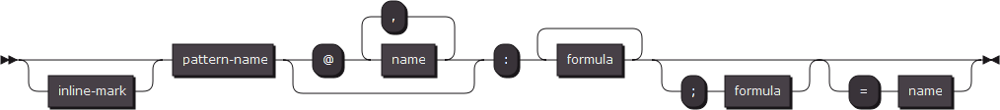
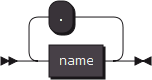
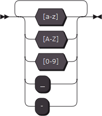
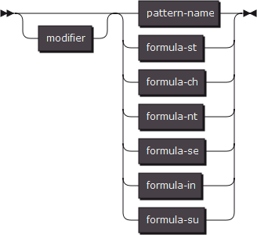
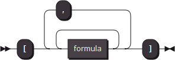
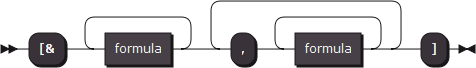
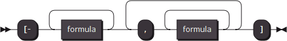
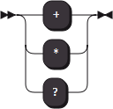

# lexical grammar

> Important Acknowledgments: 
>
> ​	Thanks to the syntax diagram build service available at http://www.bottlecaps.de/rr/ui

[TOC]

## 1. Overview

**Lexical parser** is part of **IGP** parser.

The **lexical parser** follows the word slicing rules described by **lexical grammar** to handle the **source code** and generate a **terminator vocabulary table**.

~~~mermaid
graph LR

subgraph SourceCode
cs(character sequence)
end

subgraph TerminatorTable
tk(token)
token
tk2(token)
end

subgraph Token
nm(name list)
sc(source code)
end

subgraph NameList
nameA
nameB
...
end

cs --> tk
tk --> nm
tk --> sc

nm --> nameA
nm --> nameB
nm --> ...
~~~

**Lexical grammar** is a series of **word patterns**, each of which occupies a single line.

You can insert **single line comment** anywhere using '#'.

## 2. Pattern

Every **word pattern** have the following format.

As you can see, the minimal format of the **word pattern** as follow:

We will get started by telling the format of each part of this pattern.

## 3. Pattern Name

Pattern name is combination of **legal name** strings combined by character '.'.

So let's have a look at what a **legal name string** looks like.

Do you remember the **Name List** in the diagram I just show you at the beginning.

A token owns more than one name,but maybe those names come from the same pattern.

This feature, I call it **layered name mapping system**.

In the **pattern-name string**, every dot develops a new mapping layer.

To explain this feature, let's see an example.

~~~
keyword.branch.if : "if"
~~~

Here is a pattern which captures a keyword written "if" to be a terminator.

This terminator will own three names:

~~~
keyword.branch.if
keyword.branch
keyword
~~~

This feature is prepared for the next stage of source code parsing, the syntax parsing stage.

## 4. Formula

One of the most important part of pattern is the formulas, this part tells parser what kind text you want to capture.

In the example above, this part appeared to be a sequence of character enclosed by a pair of double quoter.

Actually, there a six formats of formulas in all, the one above is one of them.

### 4.1. formula-st

"C-Style-String" stands for the strings those obey the string grammar in the C programming language.

You can use the escape characters to express characters you cannot input directly.

**Formula-st** captures the text which is exactly same as what you wrote.

### 4.2. formula-ch

Again "C-Style-String" stands for the strings those obey the string grammar in the C programming language.

But **formula-ch** takes the different action from **formula-st**.

It captures one character once, this character must appeared at least once in the C-Style-String.

### 4.3. formula-nt

**Formula-nt** captures a character once, this character must not appeared in the C-Style-String.

### 4.4. formula-se

**Formula-se** has two function, one of them is to enclose two or more formulas to be one unit by a pair of square quoter, this makes these formulas can be modified by one modifier.

The second one is to combine two or more sequences of formulas by ',' to make branches of possibility.

A number of branches of possibility can be collected to be a **possibility set**.

**Formula-in** and **formula-su** are two operations defined on the **possibility set**.

### 4.5. formula-in

**Formula-in** has the same function as the first function of **formula-se**.

The second function of **formula-in** is to perform an intersection operation between two or more **possibility set**.

### 4.6. formula-su

Just like **formula-in**, the second function of **formula-su** is to perform a subtraction operation between two or more **possibility set**.

The first **possibility set** will become the **minuend** and the following **possibility sets** will become the **subtrahend**.

### 4.7. reference

The sixth format of formula is written to be a name of existing pattern.

The pattern you are going to refer to must be a pattern defined with an **inline-mark**.

There are serial **inline pattern**s have already existing before you define them,they are called **built-in pattern**s.

These **built-in pattern**s were expressed to be some format that will be used frequently.

**Built-in pattern**s were implemented by code directly to be faster, anyway we can also express them by the **lexical grammar** to you to see what kind of text do they like.

~~~IGP-l
~numb : '01'
~numo : [numb,'234567']
~numd : [numo,'89']
~numh : [numd,'abcdefABCDEF']
~lower: 'abcdefghijklmnopqrstuvwxyz'
~upper: 'ABCDEFGHIJKLMNOPQRSTUVWXYZ'
~alpha: [lower,upper]
~space: ' \n\r\t\v'
~punct: '`~!@#$%^&*()-=_+[]{}|;:",./<>?\'\\'
~~~

There is one more **built-in pattern** that could not be expressed in **lexical grammar**, **any**, this pattern will capture any character once.

The layered name mapping system is available any time, that means you can use a high level name to collect two or more patterns in one **possibility set** this will perform the same operation as **formula-se** performs.

For example:

~~~IGP-l
~A.X : 'I'
~A.Y : 'J'
T : A ===> T : [A.X,A.Y] ===> T : ['I','J'] ===> T : 'IJ'
~~~

## 5. Modifier

As you can see,  there is an optional unit before the six kind of formulas, which is called **modifier**.

**Modifier**s change the action of parser.

### 5.1. modifier-om

**Modifier-om** is written **'+'**, makes the parser try to capture the **formula** one or more times.

### 5.2. modifier-an

**Modifier-an** is written **'*'**, makes the parser try to capture the formula any number of times.

### 5.3. modifier-op

**Modifier-op** is written **'?'**, makes the formula become optional for parser to capture.

## 6. Specified ending character

If necessary, a **specified ending character** can be determined.

The **specified ending character** is a **formula** defined after **';'**.

Parser will try to match the first character in the **formula**.

If the **minimal expression** of this **formula** is empty, means that the ending of this pattern can be the end of the source code.

## 7. Context System

A page of source code could have more than one **context**, each of them has a unique name.

The default context is named "**global**".

### 7.1. context limit

Unless explicitly declared all patterns can only be used in the **global context**.

You can declare one or more names of context which your pattern could be used in.

These context names are listed after the pattern name using a '**@**' symbol.

### 7.2. context lead

A token could lead a change of context, you can perform this action by declare a context name after the whole pattern using '**=**'.

## 8. Behaviors

### 8.1. match percentage

Consider this lexical grammar:

~~~IGP-L
label : +[alpha,'_']
keyword : "module"
~~~

The rule of **label** could match any **keyword**, that means the source code "module" could take two **terminator name** of "label" and "keyword".

That is obviously puzzling. We need a system to tell us what terminator name the author really wants or most wants, that is **match percentage**.
$$
match\ percentage = \frac{1}{\sum formula}
$$
For example,  in this case, match percentage of **label** will be $\frac1{'m'+'o'+'d'+'u'+'l'+'e'} = \frac1{alpha\times6}=\frac1 6$

And for **keyword** : $\frac1{"module"\times1}=1$

Then you can choose to keep the terminator name of the largest match percentage or order all terminator names by match percentage, so you can tell what do you really wanted.

### 8.2. capture more

~~~flow
st=>start: start
ctc=>operation: capture a character
tst=>condition: test :
rules all matched
ts2=>condition: test :
rules all not matched
cts=>operation: clean rules doesn't matched
ctp=>operation: count match percentage
otr=>operation: order and record terminator
ed=>end: end

st->ctc
ctc->tst
tst(no,left)->ts2
tst(yes)->ctc
ts2(no)->cts
cts(right)->ctc
ts2(yes)->ctp
ctp->otr
otr->ed
~~~

IGP will always try to capture the text with the longer formula.